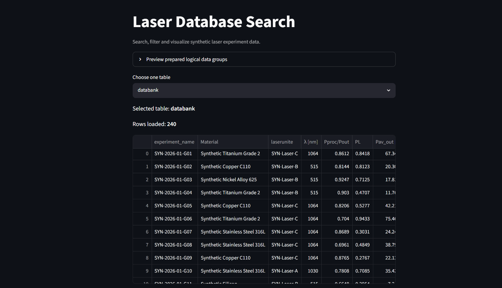
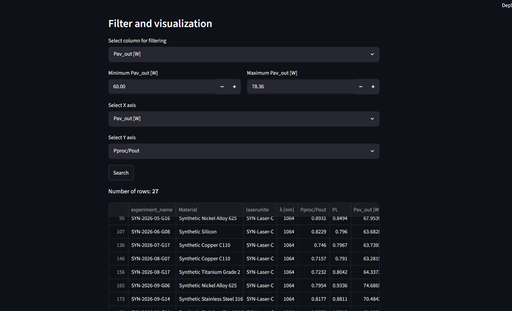
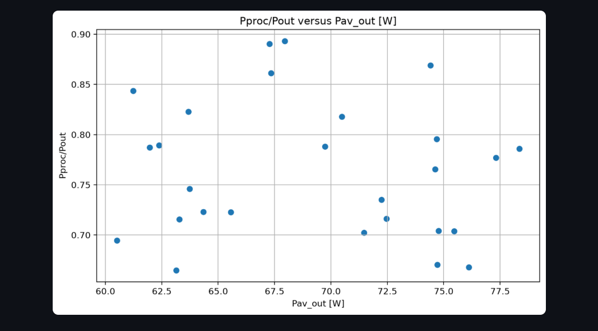

# 📊 Synthetische Laserdatenbank

Eine modulare Streamlit-Anwendung zum Suchen, Filtern, Verarbeiten und Visualisieren synthetischer Daten aus Laserexperimenten.

## 📌 Projekthintergrund

Diese Anwendung wurde ursprünglich im Rahmen meiner Tätigkeit als studentische Hilfskraft (HiWi) an einer Hochschule entwickelt.

Die ursprüngliche interne Projektversion arbeitete mit einer MySQL-Datenbank und realen Daten aus Laserexperimenten.

Für dieses öffentliche GitHub-Repository wurden alle realen Versuchsdaten, Datenbank-Zugangsdaten, internen Serverinformationen und institutionellen Ressourcen entfernt.

Die öffentliche Version verwendet stattdessen einen vollständig synthetischen Datensatz. Dieser dient ausschließlich dazu, die Softwarearchitektur, Datenverarbeitung, Filterfunktionen und Visualisierung der Anwendung zu demonstrieren.

Dieses Repository enthält keine vertraulichen Daten der Hochschule oder des Labors.

---

## 📂 Über den Datensatz

Der bereitgestellte Datensatz ist vollständig synthetisch und wurde ausschließlich für Softwareentwicklung, Datenbanktests, Filterfunktionen und Visualisierungen erstellt.

Er enthält:

* keine realen Labormessungen,
* keine personenbezogenen Daten,
* keine vertraulichen Hochschuldaten,
* keine geschützten Forschungsdaten,
* keine realen Datenbank-Zugangsdaten.

Bezeichnungen, die mit `SYN-` beginnen, kennzeichnen künstlich erzeugte Versuchs-IDs, Lasersysteme, Scanner und Messgeräte.

Die numerischen Werte wurden zu Demonstrations- und Testzwecken generiert und dürfen nicht als wissenschaftliche Ergebnisse interpretiert werden.

Die Anwendung liest den Datensatz nicht direkt aus der CSV-Datei.  
Der synthetische Datensatz muss zunächst in eine lokale MySQL-Datenbank importiert werden.

---

## 🔍 Projektfunktionen

Die Anwendung unterstützt unter anderem:

* Verbindung mit einer MySQL-Datenbank
* Laden und Anzeigen von Datenbanktabellen
* Vorbereitung und Bereinigung der geladenen Daten
* Umbenennung ausgewählter Spalten
* Zusammenführung von Prozess- und Messkommentaren
* Erzeugung einer stabilen SHA-256-basierten ID für importierte Datensätze
* Aufteilung der Daten in logische Parametergruppen
* Anzeige technischer Parameterbeschreibungen
* automatische Erkennung geeigneter numerischer Spalten
* Konvertierung numerischer Werte, einschließlich Dezimalzahlen mit Komma
* Filterung numerischer Parameter anhand eines Minimal- und Maximalwertes
* Anzeige der gefilterten Ergebnisse
* Auswahl zweier numerischer Parameter für die Visualisierung
* Darstellung der gefilterten Daten als Streudiagramm
* Auswahl weiterer Tabellen aus der verbundenen MySQL-Datenbank

---

## 🧩 Logische Datengruppen

Die Daten der Haupttabelle werden in mehrere logische Gruppen unterteilt:

* Entry information
* Laser parameters
* Scanner parameters
* Scan regime

Diese Gruppen werden innerhalb der Anwendung als separate DataFrames vorbereitet und können über die Streamlit-Oberfläche angezeigt werden.

Sie ersetzen dabei nicht die ursprünglichen Tabellen in MySQL.

---

## 🏗️ Projektarchitektur

Die Anwendung wurde refaktoriert und in mehrere Module aufgeteilt.

Dadurch sind Datenbankzugriff, Datenverarbeitung, Filterung, Visualisierung und Benutzeroberfläche voneinander getrennt.

```text
laser-database/
│
├── .streamlit/
│   └── secrets.toml
│
├── assets/
│   └── background.png
│
├── images/
│   ├── app-overview.png
│   ├── filtered-data.png
│   └── scatter-plot.png
│
├── src/
│   └── laser_database/
│       ├── __init__.py
│       ├── background.py
│       ├── config.py
│       ├── database.py
│       ├── data_groups.py
│       ├── data_processing.py
│       ├── descriptions.py
│       ├── filtering.py
│       ├── numeric_processing.py
│       ├── ui.py
│       └── visualization.py
│
├── app.py
├── run.py
├── setup.bat
├── synthetic_laser_databank.csv
├── requirements.txt
├── pyproject.toml
├── README.md
├── .gitignore
└── LICENSE
```

### Aufgaben der wichtigsten Module

* `database.py` – Aufbau der MySQL-Verbindung sowie Laden der Datenbanktabellen
* `data_processing.py` – Vorbereitung und Bereinigung der geladenen Daten
* `data_groups.py` – Aufteilung der Parameter in logische Datengruppen
* `numeric_processing.py` – Erkennung und Konvertierung numerischer Spalten
* `filtering.py` – Filterung der Daten und Vorbereitung der Plot-Daten
* `visualization.py` – Erstellung der Streudiagramme
* `descriptions.py` – Beschreibungen technischer Parameter
* `background.py` – Einbindung des Hintergrundbildes in Streamlit
* `ui.py` – Aufbau und Steuerung der Streamlit-Benutzeroberfläche
* `config.py` – zentrale Projektkonfiguration

Die Haupttabelle der Anwendung ist in `config.py` definiert als:

```python
MAIN_TABLE = "databank"
```

---

## 📈 Ergebnisse und Anwendungsbeispiel

Nach erfolgreicher Verbindung mit der lokalen MySQL-Datenbank lädt die Anwendung die synthetischen Laserexperiment-Daten und stellt sie in einer interaktiven Streamlit-Oberfläche dar.

Benutzer können:

* vorbereitete logische Datengruppen anzeigen,
* eine Datenbanktabelle auswählen,
* die Anzahl der geladenen Datensätze sehen,
* technische Parameter und ihre Beschreibungen anzeigen,
* numerische Parameter anhand eines Wertebereichs filtern,
* zwei numerische Parameter als X- und Y-Achse auswählen,
* und die gefilterten Ergebnisse als Streudiagramm darstellen.

### 📈 Übersicht der Anwendung



### 📈 Gefilterte Daten

Das folgende Beispiel zeigt die Filterung eines numerischen Parameters innerhalb eines ausgewählten Wertebereichs.



### 📈 Visualisierung

Die gefilterten Werte können als Streudiagramm dargestellt werden, um mögliche Beziehungen zwischen zwei Parametern zu untersuchen.



Alle dargestellten Ergebnisse basieren ausschließlich auf dem synthetischen Datensatz und stellen keine realen wissenschaftlichen Messergebnisse dar.

---

## ⚙️ Voraussetzungen

Für die Ausführung des Projekts werden benötigt:

* Python 3.10 oder neuer
* pip
* MySQL Server
* eine lokale MySQL-Datenbank
* der importierte synthetische Datensatz

---

## 🗄️ MySQL-Datenbank vorbereiten

Die Anwendung arbeitet mit einer MySQL-Datenbank.

Für die öffentliche Version wird ausschließlich der bereitgestellte synthetische Datensatz verwendet.

### 1. Lokale Datenbank erstellen

Erstellen Sie zunächst eine neue lokale MySQL-Datenbank.

Der Datenbankname kann frei gewählt werden.

Beispiel:

```sql
CREATE DATABASE laser_database;
```

### 2. Synthetischen Datensatz importieren

Importieren Sie anschließend:

```text
synthetic_laser_databank.csv
```

in die zuvor erstellte MySQL-Datenbank.

Die importierte Haupttabelle muss den Namen

```text
databank
```

haben, da die Anwendung diese Tabelle beim Start automatisch lädt.

Bei Verwendung von MySQL Workbench kann hierfür beispielsweise der **Table Data Import Wizard** verwendet werden.

Nach dem Import sollte die Struktur ungefähr folgendermaßen aussehen:

```text
laser_database
└── databank
```

Die Anwendung kann zusätzlich weitere Tabellen anzeigen, sofern diese in derselben Datenbank vorhanden sind.

---

## 🔐 Datenbank-Zugangsdaten konfigurieren

Die Anwendung liest die MySQL-Verbindungsinformationen über Streamlit Secrets.

Erstellen Sie lokal die Datei:

```text
.streamlit/secrets.toml
```

mit folgendem Aufbau:

```toml
[mysql]
username = "YOUR_USERNAME"
password = "YOUR_PASSWORD"
host = "localhost"
database = "YOUR_DATABASE"
```

Beispiel:

```toml
[mysql]
username = "root"
password = "YOUR_LOCAL_PASSWORD"
host = "localhost"
database = "laser_database"
```

Verwenden Sie hier ausschließlich Ihre eigenen lokalen MySQL-Zugangsdaten.

### 🔐 Sicherheit und Konfiguration

Datenbank-Zugangsdaten werden nicht im Quellcode gespeichert.

Die lokale Datenbankkonfiguration erfolgt über
`.streamlit/secrets.toml`.

Diese Datei sowie reale Zugangsdaten, interne Serveradressen und
institutionelle Konfigurationsdaten sind nicht Bestandteil dieses
öffentlichen Repositorys.

Für die lokale Einrichtung kann eine Beispielkonfiguration mit
Platzhaltern verwendet werden.

---

## 🚀 Installation unter Windows

Für Windows steht die Datei

```text
setup.bat
```

zur Verfügung.

Sie automatisiert die Einrichtung der Python-Umgebung.

Nach dem Klonen oder Herunterladen des Repositorys kann `setup.bat` ausgeführt werden.

Das Skript führt automatisch folgende Schritte aus:

1. Erstellung einer virtuellen Umgebung `.venv`
2. Aktivierung der virtuellen Umgebung
3. Aktualisierung von `pip`
4. Installation aller Pakete aus `requirements.txt`
5. Installation des lokalen Packages im Editable Mode
6. Installation von `spyder-kernels` für die Verwendung mit Spyder

Der relevante Ablauf lautet:

```bat
python -m venv .venv
call .venv\Scripts\activate
python -m pip install --upgrade pip
python -m pip install -r requirements.txt
python -m pip install -e .
python -m pip install "spyder-kernels==3.1.*"
```

Die virtuelle Umgebung sollte nicht zwischen verschiedenen Computern kopiert werden.

Jeder Benutzer kann mit `setup.bat` eine eigene lokale Umgebung erstellen.

---

## 🔧 Manuelle Installation

Alternativ kann die Installation manuell durchgeführt werden.

### 1. Repository klonen

```bash
git clone <repository-url>
cd laser-database
```

### 2. Virtuelle Umgebung erstellen

```bash
python -m venv .venv
```

### 3. Virtuelle Umgebung aktivieren

Unter Windows CMD:

```cmd
.venv\Scripts\activate
```

Unter Windows PowerShell:

```powershell
.venv\Scripts\Activate.ps1
```

Unter Linux oder macOS:

```bash
source .venv/bin/activate
```

### 4. pip aktualisieren

```bash
python -m pip install --upgrade pip
```

### 5. Abhängigkeiten installieren

```bash
python -m pip install -r requirements.txt
```

### 6. Lokales Package installieren

```bash
python -m pip install -e .
```

Die Option `-e` installiert das Package im Editable Mode.

Dadurch sind Änderungen innerhalb von

```text
src/laser_database/
```

direkt verfügbar, ohne dass das Package nach jeder Änderung erneut installiert werden muss.

---

## ▶️ Anwendung starten

Nach der Installation, dem Import des synthetischen Datensatzes in MySQL und der Konfiguration von `secrets.toml` kann die Anwendung gestartet werden.

Empfohlene Methode:

```bash
python run.py
```

`run.py` startet Streamlit automatisch mit dem aktuell verwendeten Python-Interpreter.

Alternativ kann die Anwendung direkt über Streamlit gestartet werden:

```bash
python -m streamlit run app.py
```

Anschließend wird die Streamlit-Anwendung normalerweise automatisch im Browser geöffnet.

---

## 🕷️ Verwendung mit Spyder

Das Projekt kann auch mit Spyder verwendet werden.

Nach Ausführung von `setup.bat` befindet sich der Python-Interpreter der virtuellen Umgebung unter Windows normalerweise hier:

```text
<project-folder>\.venv\Scripts\python.exe
```

Dieser Interpreter sollte in Spyder für das Projekt ausgewählt werden.

`setup.bat` installiert zusätzlich die benötigte Version von:

```text
spyder-kernels==3.1.*
```

Dadurch kann Spyder eine Konsole mit der projektspezifischen virtuellen Umgebung starten.

---

## 🔄 Datenverarbeitung

Nach dem Laden der Haupttabelle führt die Anwendung mehrere Vorbereitungsschritte durch.

Unter anderem werden:

* `Area-ID` in `experiment_name` umbenannt,
* `Laser` in `laserunite` umbenannt,
* die Spalte `No` entfernt,
* `commproc` und `commmeas` zu `UserComment` zusammengeführt,
* und für jede importierte Zeile eine SHA-256-basierte `unique ID` erzeugt.

Diese ID dient dazu, die vorbereiteten Datensätze innerhalb der Anwendung eindeutig zu referenzieren.

Die ursprünglichen MySQL-Daten werden dadurch nicht überschrieben.

---

## 🔢 Erkennung numerischer Daten

Die Anwendung prüft automatisch, welche Spalten als numerische Werte verwendet werden können.

Dabei werden unter anderem Dezimalwerte mit Komma verarbeitet.

Eine Spalte wird als numerisch behandelt, wenn ein ausreichender Anteil ihrer vorhandenen Werte erfolgreich in Zahlen konvertiert werden kann.

Diese numerischen Spalten stehen anschließend für:

* Wertebereichsfilter,
* X-Achse,
* Y-Achse,
* und Visualisierung

zur Verfügung.

---

## 🛠️ Verwendete Technologien

* Python
* Streamlit
* Pandas
* Matplotlib
* MySQL
* SQLAlchemy
* PyMySQL
* Python Virtual Environments
* Python Packaging (`pyproject.toml`)
* Spyder

---

## 🔒 Datenschutz und öffentliche Version

Dieses Repository stellt ausschließlich eine öffentliche Demonstrationsversion des Projekts dar.

Die Softwarearchitektur basiert auf der im Rahmen der ursprünglichen Tätigkeit entwickelten Anwendung.

Vor der Veröffentlichung wurden jedoch sämtliche vertraulichen oder institutionellen Bestandteile entfernt.

Das öffentliche Repository enthält insbesondere keine:

* realen Laserexperiment-Daten,
* vertraulichen Forschungsdaten,
* personenbezogenen Daten,
* realen Datenbank-Benutzernamen,
* realen Datenbank-Passwörter,
* internen Serveradressen,
* institutionellen Netzwerkpfade,
* produktiven Streamlit-Secrets.

Die öffentlich bereitgestellten Daten sind vollständig synthetisch.

Benutzer der öffentlichen Version richten eine eigene lokale MySQL-Datenbank ein und verwenden ausschließlich ihre eigenen lokalen Zugangsdaten.

---

## 👩‍💻 Autorin

**Romina Emadi**

Data Science Studentin | Ziel: Data Analyst

---

## 📜 License

MIT License
